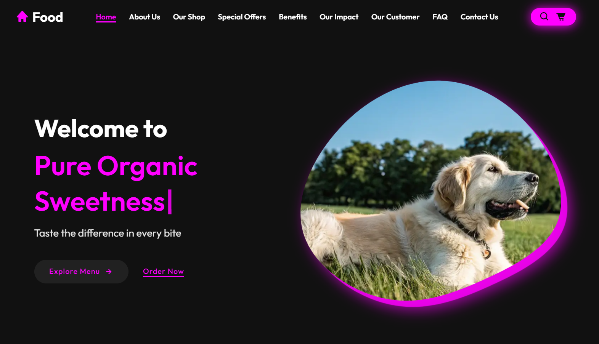

#  <a href="https://html.org/" target="_blank" rel="noreferrer">   

### [Site link] https://volodymyr-fullsrack-pro.github.io/Food-Template-for-Generation/)

### Author

- Volodymyr Babiichuk - https://volodymyrcodepro.online/
